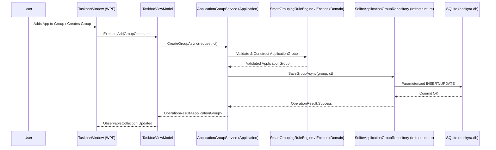
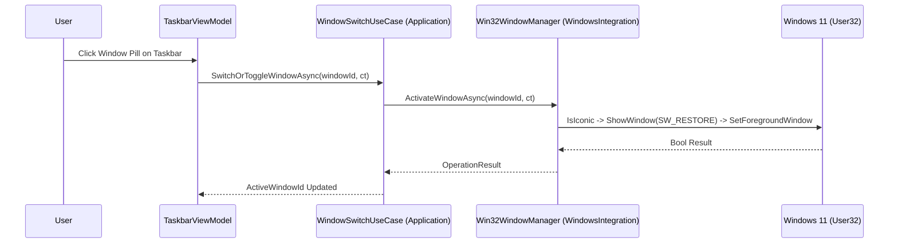

# Data Flow (`planning/architecture/data-flow.md`)

## 1. User Action to Persistence Flow

```mermaid
sequenceDiagram
    participant User
    participant View as TaskbarWindow (WPF)
    participant VM as TaskbarViewModel
    participant AppSvc as ApplicationGroupService (Application)
    participant Domain as SmartGroupingRuleEngine / Entities (Domain)
    participant Repo as SqliteApplicationGroupRepository (Infrastructure)
    participant DB as SQLite (dockyra.db)

    User->>View: Adds App to Group / Creates Group
    View->>VM: Execute AddGroupCommand
    VM->>AppSvc: CreateGroupAsync(request, ct)
    AppSvc->>Domain: Validate & Construct ApplicationGroup
    Domain-->>AppSvc: Validated ApplicationGroup
    AppSvc->>Repo: SaveGroupAsync(group, ct)
    Repo->>DB: Parameterized INSERT/UPDATE
    DB-->>Repo: Commit OK
    Repo-->>AppSvc: OperationResult.Success
    AppSvc-->>VM: OperationResult<ApplicationGroup>
    VM-->>View: ObservableCollection Updated
```

## 2. Window Activation Flow

```mermaid
sequenceDiagram
    participant User
    participant VM as TaskbarViewModel
    participant UseCase as WindowSwitchUseCase (Application)
    participant WinMgr as Win32WindowManager (WindowsIntegration)
    participant OS as Windows 11 (User32)

    User->>VM: Click Window Pill on Taskbar
    VM->>UseCase: SwitchOrToggleWindowAsync(windowId, ct)
    UseCase->>WinMgr: ActivateWindowAsync(windowId, ct)
    WinMgr->>OS: IsIconic -> ShowWindow(SW_RESTORE) -> SetForegroundWindow
    OS-->>WinMgr: Bool Result
    WinMgr-->>UseCase: OperationResult
    UseCase-->>VM: ActiveWindowId Updated
```

